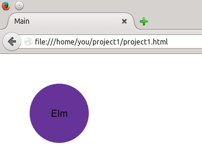

<!DOCTYPE html>
<html xml:lang="en" lang="en" xmlns="http://www.w3.org/1999/xhtml">
<head>
    <title>Installing Elm on Ubuntu</title>
    <meta http-equiv="Content-Type" content="text/html; charset=utf-8" />
    <link rel="stylesheet" type="text/css" href="style.css"/>
</head>
<body>

Installing Elm on Ubuntu
========================

These instructions are what I used to install [Elm](http://elm-lang.org) on Ubuntu 14.04 (Trusty Tahr) Your mileage may definitely vary. These instructions are written for a user named `you`.

Haskell
-------

You will want to install the [Haskell](http://haskell.org) compiler and [Cabal](https://www.haskell.org/cabal/), the Common Architecture for Building Applications and Libraries:

	you@localhost:~$ sudo apt-get install ghc cabal-install

For Ubuntu 14.04, the Haskell compiler (`ghc`) is sufficiently new, but `cabal` is not the latest and greatest version.

	you@localhost:~$ ghc --version
	The Glorious Glasgow Haskell Compilation System, version 7.6.3
	you@localhost:~$ cabal --version
	cabal-install version 1.16.0.2
	
First, update the list of packages available to install:

	you@localhost:~$ cabal update
	Config file path source is default config file.
	Config file /home/you/.cabal/config not found.
	Writing default configuration to /home/you/.cabal/config
	Downloading the latest package list from hackage.haskell.org
	
In order to make the latest version of cabal available to all users, install it to `/usr/local`:

	you@localhost:~$ sudo cabal install cabal-install --prefix=/usr/local
	*much output which I won&rsquo;t reproduce here*
	Installing executable(s) in /usr/local/bin
	Installed cabal-install-1.20.3

Note: You may need to have the `zlib1` package installed in order to build properly. On my system, the packages were `zlib1g` and `zlib1g-dev`.

After the install is finished, close your terminal, open it again, and check the version. If `/usr/local/bin` is on your `$PATH` before `/usr/bin`, you should get results like this:

	you@localhost:~$ cabal --version
	cabal-install version 1.20.0.3
	using version 1.20.0.2 of the Cabal Library

Since you did the install with `sudo`, the `$HOME/.cabal` directory may have some files marked as owned by the root user. Fix this by doing the following (replacing `you` with your user name). Then, as yourself, again make sure you have the latest packages.

    you@localhost:~$ sudo chown -R you:you /home/you/.cabal
    you@localhost:~$ cabal update

git
---
You will also need the `git` version control system, as the build process downloads the source from [github](https://github.com):

    you@locatlhost:~$ sudo apt-get install git 
    
nodejs
------
If you want to use the Elm REPL, you will need Node.js. On Ubuntu, you do this:

    you@localhost:~$ sudo apt-get install nodejs
  
The interpreter on Ubuntu is called `nodejs` because there is already a package named `node`, which happens to be an Amateur Packet Radio Node program. Thus, you will have to let the REPL know this new name. In a file named `~/.bash_aliases`, add this line:

    elm-repl='elm-repl --interpreter=node-js'

To activate this alias without having to log out and log in again, do this:

    you@localhost:~$ source ~/.bash_aliases

(If you don&rsquo;t want to create the alias, you will have to type the `--interpreter=nodejs` every time you run the REPL. Your choice.)

Building Elm
------------

Download the `BuildFromSource.hs` script from [`https://raw.githubusercontent.com/elm-lang/elm-platform/master/src/BuildFromSource.hs`](https://raw.githubusercontent.com/elm-lang/elm-platform/master/src/BuildFromSource.hs).

Now, open a shell as the root user and check to see that `/usr/local/bin` is on the `$PATH`, because you will need the proper version of `cabal`.

    you@localhost:~$ sudo -s
    root@localhost:~# echo $PATH
    /usr/local/sbin:/usr/local/bin:/usr/sbin:/usr/bin:/sbin:/bin
    
If it isn&rsquo;t there, do this command:

    root@localhost!# export PATH=/usr/local/bin:$PATH

The following commands will create a directory named `Elm-Platform` and install the version of Elm found on github&rsquo;s master branch; it presumes that the `BuildFromSource.hs` script is in your home directory:

    root@localhost:~# cd /usr/local
    root@localhost:/usr/local# runhaskell /home/you/BuildFromSource.hs master

Now, you must add the correct directory to your `$PATH`. Edit your `~/.profile` and add this line at the end:

    PATH=$PATH:/usr/local/Elm-Platform/master/bin
    
You will have to log out and log in again for this to take effect.

Using Elm
---------
At this point, try these commands to see that everything is installed correctly:

    you@localhost:~$ elm-package --help
    you@localhost:~$ elm-repl --help
    you@localhost:~$ elm-make --help
    
Your First Project
------------------
Create a directory named `project1` and `cd` into it:

    you@localhost:~$ mkdir project1
    you@localhost:~$ cd project1
    
Then create a file named `project1.elm` with these contents, using your favorite text editor:

    import Text (..)
    import Graphics.Element (..)
    import Graphics.Collage (..)
    import Color (..)

    main : Element

    main = collage 200 200 [
        filled (rgb 102 51 153) (circle 50),
        toForm (plainText "Elm")
        ]

Now build the project with output to a file named `project1.html`. The first time you build your project, `elm-make` will detect packages you need and ask you if you want them. You don&rsquo;t get the question after the first build, unless you need other packages.

    you@localhost:~/project1$ elm-make --output project1.html project1.elm
    Some new packages are needed. Here is the upgrade plan.

    Install:
        elm-lang/core 1.0.0

    Do you approve of this plan? (y/n) y
    Packages configured successfully!
    Compiled 33 files                                                   
    Successfully generated project1.html
    you@localhost:~/project1$ ls
    elm-package.json  elm-stuff  project1.elm  project1.html

Load the project1.html file into your browser, and you should see something like this:

Now explore the examples and documentation at [the Elm web site](http://elm-lang.org/) and make really cool stuff!

Note: Installing on Fedora
--------------------------
The same sequence will work on Fedora 19 (the version on which I tested it); the only changes are to use `yum` instead of `apt-get`, and you do not need to put in the alias for `elm-repl`, as Fedora uses the name `node` for Node.js.

</body>
</html>
